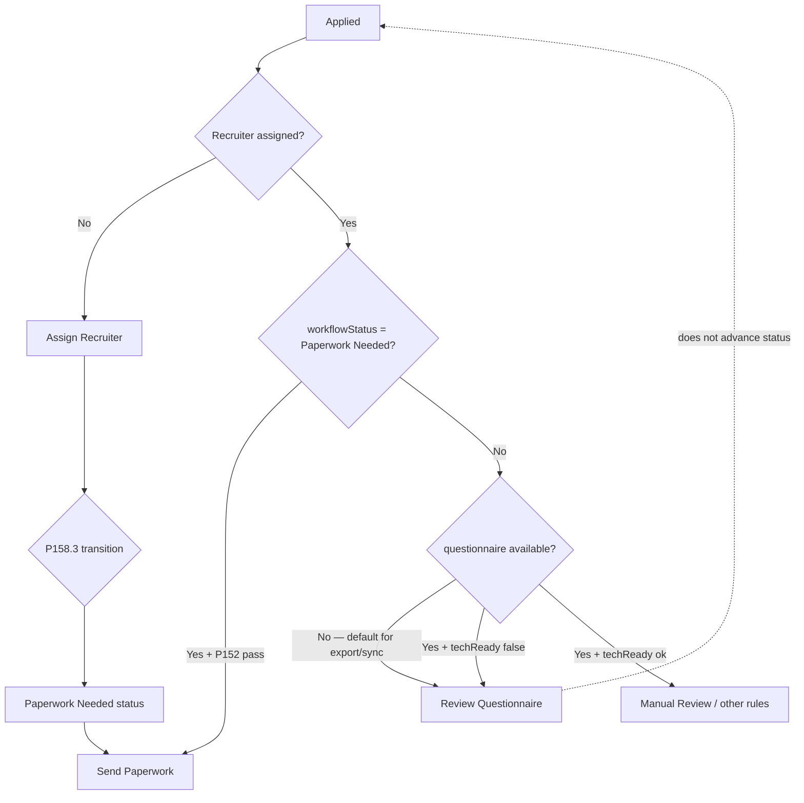

# P177.1 — Business Workflow Validation (Questionnaire Gate)

Generated: 2026-07-09T16:15:00.000Z  
Mode: read-only investigation (no code changes, no paperwork send, no automation enablement)

## Verdict

**Review Questionnaire is primarily an implementation artifact**, not an intentional mandatory business step before paperwork.

Missing Breezy questionnaire enrichment defaults `questionnaireIntelligence.available` to `false`, which P157 treats the same as “incomplete questionnaire” and routes to **Review Questionnaire** for `Applied`-status candidates. **P157 Send Paperwork does not require questionnaire answers** — it requires P152 eligibility plus workflow stage `Paperwork Needed`.

The canonical post-assignment automation path documented in P158.2/P158.3 is:

**Applied → Assign Recruiter → Paperwork Needed (P158.3) → Send Paperwork**

—not:

Applied → Assign Recruiter → Review Questionnaire → Paperwork Needed → Send Paperwork

**Confidence: high**

---

## P157 decision cascade (rule order matters)

P157 evaluates rules top-to-bottom in `evaluateP157ActionRule` (`action-rules.ts`). First match wins.

| Order | Action | Lines | Condition |
| ---: | --- | --- | --- |
| 1 | Assign Recruiter | 64–67 | `isUnassignedRecruiter(row.assignedRecruiter)` |
| 2 | **Send Paperwork** | 70–86 | `ctx.paperworkEligible` AND (`workflowStatus === "Paperwork Needed"` OR paperwork stage awaitingRecruiterAction/approvalQueue) |
| 3 | Follow Up Today | 106–114 | overdue follow-up / needsFollowUp / paperwork viewed ≥2 |
| 4 | Wait For Candidate | 117–127 | paperwork sent/viewed |
| 5 | Request Missing Documents | 130–134 | `ctx.missingDocuments.length > 0` |
| 6 | **Review Questionnaire** | 137–140 | `!ctx.questionnaireComplete` OR `ctx.questionnaireTechReady === false` |
| 7 | Escalate To DM | 143–151 | DM assignment/review flags |
| 8 | Manual Review | 154–170 | paperwork blockers / Applied·Needs Review·Qualified |

**Important:** `Paperwork Needed` is a **workflow status**, not a P157 action. P157 never returns it. Status is set by P83, P158.3, or recruiter workspace actions.

---

## Exact code locations

### Assign Recruiter

- **File:** `src/lib/p157-recruiter-decision-engine/action-rules.ts`
- **Function:** `evaluateP157ActionRule`
- **Lines:** 64–67
- **Conditional:** `isUnassignedRecruiter(row.assignedRecruiter)`
- **Introduced:** commit `795bbf8` (2026-07-07) — *P157 intelligent recruiter decision engine*

### Send Paperwork

- **File:** `src/lib/p157-recruiter-decision-engine/action-rules.ts`
- **Function:** `evaluateP157ActionRule`
- **Lines:** 70–86
- **Conditional:**

```typescript
ctx.paperworkEligible &&
(row.workflowStatus === "Paperwork Needed" ||
 paperworkStage === "awaitingRecruiterAction" ||
 paperworkStage === "approvalQueue")
```

- **Questionnaire:** **not in condition**. Line 78 only adds an informational signal when questionnaire is complete.
- **P152 mapping:** `buildP157DecisionContext` → `detectImmediatePaperworkHardBlockers` (`decision-engine.ts:52-58`)
- **Introduced:** commit `795bbf8` (2026-07-07)

### Review Questionnaire

- **File:** `src/lib/p157-recruiter-decision-engine/action-rules.ts`
- **Function:** `evaluateP157ActionRule`
- **Lines:** 137–140
- **Conditional:**

```typescript
!ctx.questionnaireComplete || ctx.questionnaireTechReady === false
```

- **Context mapping** (`decision-engine.ts:76-77`):

```typescript
questionnaireComplete: row.questionnaireIntelligence.available,
questionnaireTechReady: row.questionnaireIntelligence.techReady,
```

- **Missing-data default** (`questionnaire-parser.ts:309-310`):

```typescript
if (answers.length === 0) return unavailableQuestionnaire(); // available: false
```

- **Introduced:** commit `795bbf8` (2026-07-07); parser defaults from P56 (`8371703`, 2026-06-22)

### Paperwork Needed (status, not P157 action)

| Setter | File | Notes |
| --- | --- | --- |
| P158.3 transition | `p158-post-assignment-workflow-transition/transition-engine.ts:28` | Sets `workflowStatus: "Paperwork Needed"`, `actionType: "send-paperwork"` |
| P158.3 eligibility | `transition-rules.ts` | Checks P152 hard blockers, recruiter/DM assigned — **no questionnaire check** |
| P83 advancement | `candidate-advancement-engine/apply-candidate-advancements.ts` | Confidence/approval gated |
| Workspace | `candidate-workspace/advance-workflow-on-complete.ts:28` | `schedule-interview` action |

---

## Questionnaire design intent

| Question | Answer |
| --- | --- |
| Was questionnaire designed as **REQUIRED** for paperwork send in P157? | **No** — Send Paperwork rule has no questionnaire condition |
| Was it designed as **OPTIONAL** intelligence? | **Yes** — P56/P86 grading and tech-readiness; UI shows “Not available from Breezy yet.” when missing |
| Did missing data **accidentally** create Review Questionnaire? | **Yes** — `available: false` from empty answers triggers same rule as incomplete questionnaire |

### Questionnaire fields checked (when data exists)

Parsed in `questionnaire-parser.ts` → `QUESTION_KEY_MAP`: merchandising experience, prior vendor, smartphone, internet, apps comfort, printer/laptop, photo upload, schedule understanding, availability notes; `techReady` derived from smartphone + internet + apps.

### What P152 covers (send safety — unchanged)

Recruiter assigned, valid email, duplicates, active signatures, already sent/completed, disqualified/archived. P152 `BYPASSED_RULES` explicitly bypass legacy workflow/questionnaire gates for immediate policy.

---

## Codebase search summary

| Term | Finding |
| --- | --- |
| `Review Questionnaire` | P157 action; P169/P171 treat as manual-review exception (“Unexpected classification”) |
| `Paperwork Needed` | Workflow status; required for P84 send eligibility; set by P158.3/P83 |
| `questionnaireIntelligence` | Built per candidate in `questionnaire-parser.ts`; attached in `build-candidate-workflow-row.ts` |
| `questionnaireRequired` | **Not in production code** — only P177 diagnosis artifacts |
| `questionnaireAvailable` | Field `questionnaireIntelligence.available` in `candidate-readiness/types.ts` |
| `Send Paperwork` | P157:70-86; P169 maps to `AUTO_SEND_PAPERWORK` when confidence ≥ threshold |

---

## UI and documentation expectations

**Recruiter UI does not encode a mandatory Review Questionnaire funnel step.**

- `recruiting-decisions-panel.tsx` — displays whatever P157 returns; no hardcoded sequence
- `resolve-workspace-action.ts` — Applied → “Contact candidate”; no questionnaire gate
- `candidate-questionnaire-intelligence-panel.tsx` — informational; handles missing data gracefully

**Documented automation path (P158.2 / P158.3 artifacts):**

> After recruiter assignment, auto-advance workflow to Paperwork Needed … re-run P157

P158.3 dry-run (2026-07-07): **25/25** candidates `Applied → Paperwork Needed → Send Paperwork` with **no questionnaire requirement**.

P158.2 diagnosed **workflow_state_issue** (not `missing_questionnaire`) as the blocker for 25/25 post-assignment candidates.

---

## Workflow diagram



**Current newest-25 behavior (post-P176):** 21 candidates stuck at **Review Questionnaire** on `Applied` because enrichment never populated questionnaire data. P177: questionnaire bypass alone → **0** Send Paperwork; with P158.3-style workflow advance → **21** Send Paperwork (4 remain blocked: duplicates + unassigned).

---

## Would changing the questionnaire gate alter intended business behavior?

**No — it would restore the intended workflow.**

Evidence:

1. P158.3 already transitions without questionnaire and projects Send Paperwork
2. P152 intentionally bypasses legacy questionnaire gates
3. P169/P171 do not treat Review Questionnaire as a normal automation step
4. Original P157 cohort: 2 Send Paperwork (already Paperwork Needed) vs 7 Review Questionnaire (missing enrichment)

**Keep blocking** when `questionnaireTechReady === false` (confirmed failed tech screening) — that is a legitimate business gate.

---

## Recommendation

### Primary (safest, already built)

**Run P158.3 post-assignment workflow transition** after recruiter assignment for P152-eligible candidates. No P157 change required. Advances `Applied → Paperwork Needed`; P157 then returns Send Paperwork.

### Secondary (if P157 must change)

Narrow Review Questionnaire to failed tech only:

```typescript
// action-rules.ts:137 — from:
if (!ctx.questionnaireComplete || ctx.questionnaireTechReady === false)
// to:
if (ctx.questionnaireTechReady === false)
```

Still requires P158.3 (or equivalent) for Send Paperwork — questionnaire change alone does not advance workflow status.

### Smallest code change

| Option | Change | Lines |
| --- | --- | --- |
| **A (recommended)** | Orchestrate existing P158.3 | 0 — feature exists |
| B | Narrow P157 Review Questionnaire conditional | 1 line |

**Expected paperwork send count after Option A:** 21 (per P177 simulation, excluding 3 duplicates + 1 unassigned)

---

## Contradictions to resolve in future work

1. **P158.2 `diagnose-blocker.ts`** flags `missing_questionnaire` but **P158.3 `transition-rules.ts`** ignores questionnaire — transition path is authoritative for post-assignment automation
2. **P177 artifact** incorrectly listed questionnaire as a Send Paperwork requirement — corrected here: questionnaire gates **Review Questionnaire** only

---

## Safety confirmation

- Read-only investigation only
- No paperwork sent, no Breezy/Dropbox writes, no automation enabled
- P152 duplicate/signature/email gates remain regardless of questionnaire change
- P158.3 is workflow overlay only — does not send paperwork
