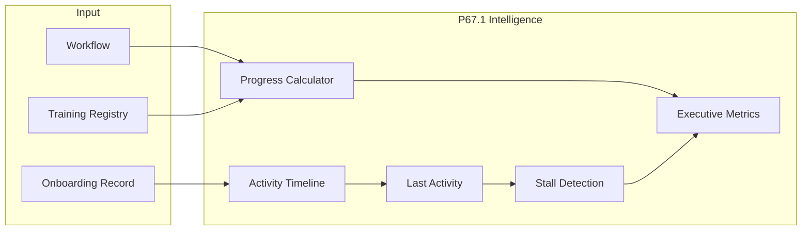

# P67.1 — Onboarding Progress & Activity Intelligence Validation Report

**Validated:** 2026-06-26  
**Mode:** Preview only — no production writes, no live emails, no automation execution  
**Builds on:** P67 Autonomous Onboarding Engine

---

## Executive summary

P67.1 adds progress percentage, last activity tracking, activity timelines, stalled candidate detection, and executive progress metrics — all computed from read-only preview snapshots.

| Check | Result |
|-------|--------|
| Progress auto-calculated from steps | ✅ Lifecycle + training registry |
| Last activity + elapsed time | ✅ |
| Activity timeline with timestamps | ✅ |
| Stalled detection (normal / attention / high risk / blocked) | ✅ |
| Executive progress metrics | ✅ |
| Candidate workspace enhancements | ✅ |
| Unit tests | ✅ 11/11 autonomous-onboarding tests |
| Full suite | ✅ 372/372 passing |
| Production build | ✅ Passes |

---

## Progress calculation example

**Candidate:** Alex Rivera (signed paperwork, welcome prepared)

```
█ █ █ █ ░ ░ ░ ░ ░ ░

40% Complete — 4 of 10 steps completed
```

Steps are defined in `listOnboardingProgressStepDefinitions()`:

- 8 lifecycle states (paperwork pending → ready for work)
- 3 training modules (from `TRAINING_MODULE_REGISTRY`)

Adding a new training module to the registry **automatically increases total steps** without code changes to the calculator.

---

## Last activity example

```
Last Activity
Store Call Training Completed
June 26, 2026, 9:18 AM

Elapsed: 42 minutes ago
```

Derived from the most recent `completed` entry in `activityTimeline`.

---

## Activity timeline example

```
✓ Paperwork Sent          June 25, 2:13 PM
✓ Paperwork Signed        June 25, 4:46 PM
✓ Welcome Generated       June 25, 4:47 PM
✓ Training Assigned       June 25, 4:48 PM
→ Waiting for MEL Test Survey
```

Each entry includes: timestamp (when available), status (`completed` | `current`), and step name.

---

## Stalled candidate examples

| Level | Trigger | Example |
|-------|---------|---------|
| **Normal** | Last activity &lt; 24 hours | Active training progress |
| **Needs Attention** | No progress in 2+ days | Awaiting survey completion |
| **High Risk** | No progress in 5+ days | Stuck after training assigned |
| **Blocked** | Missing required step / paperwork error | Dropbox failure on workflow |

Executive dashboard surfaces stalled candidates sorted by severity.

---

## Executive progress metrics

| Metric | Description |
|--------|-------------|
| Total Onboarding | Candidates in post-paperwork pipeline |
| Average Progress % | Mean of per-candidate progress |
| Average Time Between Steps | Mean gap between completed timeline events |
| Candidates Waiting | Remaining steps, not blocked |
| Candidates Blocked | Stall level = blocked |
| Ready For Work Today | Readiness satisfied today (preview) |
| Average Days To Ready | Mean days from paperwork sent to ready (preview) |

---

## Candidate workspace (recruiter view)

The **Onboarding automation** panel now shows within seconds:

- Progress bar + block visualization
- Current state + stall badge
- Last activity with timestamp and elapsed time
- Full activity timeline
- Next step + next planned automation
- Ready For Work status + missing requirements
- Welcome email preview (not sent)

---

## Architecture (P67 + P67.1)



---

## Validation script

```bash
npx tsx scripts/p67-1-validate-preview.ts
```

Sample output fields: `progressMetrics`, `stalledCount`, `sampleCandidate.progressPercent`, `lastActivity`, `stall`.

---

## Files added / updated

**New:**
- `onboarding-progress-registry.ts`
- `build-onboarding-progress.ts`
- `build-onboarding-activity-intelligence.ts`
- `build-executive-progress-metrics.ts`
- `scripts/p67-1-validate-preview.ts`

**Updated:**
- `types.ts`, `build-onboarding-workspace-snapshot.ts`, `build-autonomous-onboarding-dashboard.ts`
- `autonomous-onboarding-panel.tsx`, `candidate-onboarding-preview-panel.tsx`
- `autonomous-onboarding-engine.test.ts`

---

## Success criteria

| Question | Answered by |
|----------|-------------|
| How far through onboarding? | `progress.progressPercent` |
| Last completed task? | `lastActivity.label` |
| When was it completed? | `lastActivity.completedAt` |
| How long inactive? | `lastActivity.elapsedLabel` / `stall` |
| Next step? | `nextStepLabel` |
| Falling behind? | `stall.level` |
| Ready For Work? | `readiness.status` |

**Preview Mode protections maintained.** No commit included per instructions.
