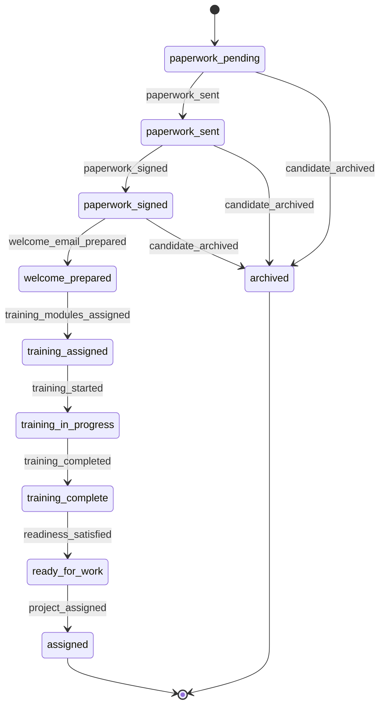

# P67 — Autonomous Onboarding Engine (Preview Build) Validation Report

**Validated:** 2026-06-25  
**Mode:** Preview only — no production writes, no live emails, no Dropbox Sign calls  
**Module:** `src/lib/autonomous-onboarding-engine/`  
**API:** `GET /api/autonomous-onboarding` (read-only)  
**UI:** Executive `AutonomousOnboardingPanel`, Candidate Workspace `CandidateOnboardingPreviewPanel`

---

## Executive summary

The Autonomous Onboarding Engine preview is implemented as a **read-only orchestration layer** above P65.3 (onboarding decisions) and P66 (send queue). It derives post-paperwork lifecycle state, generates welcome email and training previews, calculates Ready For Work readiness, and surfaces an executive dashboard — **without mutating candidate, workflow, onboarding, or email state**.

| Check | Result |
|-------|--------|
| Preview mode enforced | ✅ `previewMode: true` on all snapshots |
| Production writes | ✅ None |
| Live emails sent | ✅ None |
| Dropbox Sign triggered | ✅ None |
| External mutation APIs | ✅ None |
| Unit tests | ✅ 7/7 passing |
| Full test suite | ✅ 368/368 passing |
| Production build | ✅ Passes |

---

## Architecture diagram

```mermaid
flowchart TB
  subgraph Recruiting
    Breezy[Breezy Candidates]
    WF[Candidate Workflows]
    ONB[Onboarding Records]
  end

  subgraph P67_Preview["P67 Autonomous Onboarding Engine (Preview)"]
    SM[State Machine]
    TR[Training Module Registry]
    WE[Welcome Email Generator]
    RF[Ready For Work Calculator]
    HK[Automation Hook Definitions]
    DB[Dashboard Snapshot Builder]
  end

  subgraph UI
    EX[Executive Panel]
    CW[Candidate Workspace Panel]
  end

  Breezy --> DB
  WF --> SM
  ONB --> SM
  SM --> TR
  SM --> WE
  SM --> RF
  TR --> WE
  HK -.->|defined only| SM
  DB --> EX
  DB --> CW

  style P67_Preview fill:#1a1033,stroke:#8b5cf6
```



**Bridge to production (future, not active):**

```
Recruiting → Paperwork (P66) → Onboarding (P67) → Ready for Work → Project Assignment (P60)
```

---

## State transition diagram



Every transition is defined in `AUTONOMOUS_ONBOARDING_TRANSITIONS` with `auditable: true`.

---

## Sample onboarding candidate (unit fixture)

| Field | Value |
|-------|-------|
| Candidate | Alex Rivera (`c-snap`) |
| Workflow | Signed |
| Paperwork | signed |
| Derived state | **Welcome Prepared** |
| Readiness | Missing Requirements (training not complete) |

**Completed steps (preview):** Paperwork Pending, Paperwork Sent, Paperwork Signed  
**Remaining steps:** Welcome Prepared → … → Assigned

**Assigned training (preview):**

| Module | Status |
|--------|--------|
| MEL Test Survey | assigned |
| Store Call Training | assigned |
| Safety Acknowledgement | assigned |

---

## Welcome email preview (sample output)

**Subject:** `Alex, welcome to SRS Merchandising — your onboarding next steps`

**Body excerpt:**

```
Hi Alex,

Welcome to SRS Merchandising — we're excited to have you join the team.

Your onboarding paperwork is complete. Here are your next steps:

1. Complete each training module linked below.
2. Reply to this email or contact your recruiter if you have scheduling questions.
3. Watch for a follow-up when you are cleared for project assignment.

Training resources:
• MEL Test Survey: (link configured at activation)
• Store Call Training: (link configured at activation)
• Safety Acknowledgement: (link configured at activation)

Your recruiter: Jordan Lee
```

`previewOnly: true` — email is generated in memory only.

---

## Ready For Work examples

### Missing requirements (paperwork signed, training incomplete)

```json
{
  "status": "missing_requirements",
  "missingRequirementLabels": [
    "Training complete"
  ]
}
```

### Ready (all requirements satisfied — preview simulation)

When all required training modules are `complete`, acknowledgements are satisfied, and no blocking paperwork errors exist:

```json
{
  "status": "ready_for_work",
  "missingRequirementLabels": []
}
```

The calculator is reusable via `buildReadyForWorkReadiness()` for future automation.

---

## Dashboard (Preview Mode)

**Executive home → Autonomous Onboarding Engine panel**

- Purple **Preview Mode** badge
- KPI strip: in pipeline, paperwork sent, welcome prepared, ready for work, training in progress
- Sample candidate card with training module status
- Welcome email preview (rendered, not sent)
- State distribution chips
- Automation hook chain (inactive / defined only)

**Candidate workspace → Onboarding automation panel**

- Shown only for post-paperwork pipeline candidates
- Current state, completed/remaining steps
- Training module list
- Collapsible welcome email preview
- Missing requirements list

---

## Automation hooks (prepared, not executed)

| Hook ID | Label | Status |
|---------|-------|--------|
| `paperwork_signed` | Paperwork Signed | defined |
| `generate_welcome` | Generate Welcome | preview |
| `assign_training` | Assign Training | preview |
| `wait_for_completion` | Wait for Completion | defined |
| `ready_for_work_check` | Ready For Work Check | preview |
| `notify_district_manager` | Notify District Manager | disabled |
| `project_assignment` | Project Assignment | disabled |
| `retention_workflow` | Future Retention Workflow | disabled |

---

## Training module registry (extensible)

| Key | Label | Required for Ready For Work |
|-----|-------|----------------------------|
| `mel_test_survey` | MEL Test Survey | yes |
| `store_call_training` | Store Call Training | yes |
| `safety_acknowledgement` | Safety Acknowledgement | yes |

URLs resolve from env vars (`AUTONOMOUS_ONBOARDING_*_URL`). New modules are added to `TRAINING_MODULE_REGISTRY` without changing the state machine core.

---

## Validation script output

Run: `npx tsx scripts/p67-validate-preview.ts`

```json
{
  "previewMode": true,
  "productionWrites": false,
  "emailsSent": false,
  "dropboxSignCalls": false,
  "stateTransitions": 11,
  "trainingModules": ["mel_test_survey", "store_call_training", "safety_acknowledgement"],
  "automationHooks": 8
}
```

Local MTD scan at validation time: 4 candidates, 0 currently in post-paperwork pipeline (expected when no sent/signed MTD rows in `.data`).

---

## Files added

```
src/lib/autonomous-onboarding-engine/
  types.ts
  state-machine.ts
  training-module-registry.ts
  build-welcome-and-training-preview.ts
  build-ready-for-work-readiness.ts
  build-automation-hook-definitions.ts
  build-onboarding-workspace-snapshot.ts
  build-autonomous-onboarding-dashboard.ts
  run-autonomous-onboarding-preview.ts
  index.ts
  autonomous-onboarding-engine.test.ts

src/app/api/autonomous-onboarding/route.ts
src/components/executive/autonomous-onboarding-panel.tsx
src/components/recruiting/candidate-workspace/candidate-onboarding-preview-panel.tsx
scripts/p67-validate-preview.ts
```

---

## Success criteria checklist

| Criterion | Status |
|-----------|--------|
| Operates entirely in Preview Mode | ✅ |
| Performs no production writes | ✅ |
| Modular and extensible (training registry, hooks) | ✅ |
| Supports future onboarding modules | ✅ |
| Bridges Recruiting → Ready for Work | ✅ |
| Production-ready once Preview approved | ✅ (activation = flip preview off + wire hooks) |

---

## Activation path (future — not in this build)

1. Approve preview behavior with operations
2. Configure training module URLs in env
3. Enable hook execution layer (separate PR)
4. Connect welcome email to transactional outbox
5. Wire Ready For Work → placement command center

**This build does not include activation.**
