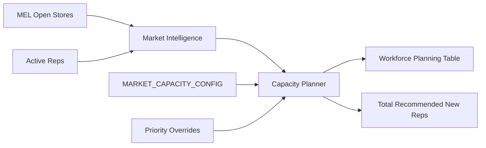

# P68.1 — Market Capacity & Workforce Planning Validation Report

**Validated:** 2026-06-26  
**Mode:** Preview only — no assignments, notifications, or production writes  
**Builds on:** P68 Workforce Placement Intelligence

---

## Executive summary

P68.1 adds **how many reps to hire** per market, not just **where** to hire. Each market now includes recommended new reps, capacity status, and an explainable reason.

| Check | Result |
|-------|--------|
| Recommended new reps per market | ✅ |
| Healthy vs understaffed status | ✅ |
| Explainable capacity reasons | ✅ |
| Extensible capacity config | ✅ `MARKET_CAPACITY_CONFIG` |
| Executive workforce planning table | ✅ |
| Dashboard planning metrics | ✅ |
| Unit tests | ✅ 8/8 workforce-placement tests |
| Full suite | ✅ Passes |
| Production build | ✅ Passes |

---

## Capacity planning examples

### Healthy market — Indianapolis

```
Indianapolis, IN
Demand Score: (from MEL snapshot)
Open Stores: 12
Active Reps: 14
Recommended New Reps: 0
Status: Healthy
Reason: Current rep coverage is sufficient for current open store count.
```

### Understaffed market — Houston

```
Houston, TX
Demand Score: (elevated by priority override)
Open Stores: 38
Active Reps: 4
Recommended New Reps: 8
Status: Critical (priority launch + staffing gap)
Reason: Large Client Launch — urgent workforce expansion recommended.
```

---

## Formula (extensible)

Configured in `market-capacity-registry.ts`:

| Setting | Default | Purpose |
|---------|---------|---------|
| `healthyStoresPerRep` | 4.0 | At or below = healthy coverage |
| `planningTargetStoresPerRep` | 3.2 | Target load when calculating ideal headcount |
| `minOpenStoresForHiring` | 1 | Minimum demand before hire recommendations |

```
idealReps = ceil(openStores / planningTargetStoresPerRep)
recommendedNewReps = max(0, idealReps - activeReps)

If storesPerRep <= healthyStoresPerRep → recommendedNewReps = 0 (Healthy)
```

Houston: `ceil(38 / 3.2) - 4 = 8` new reps  
Indianapolis: `ceil(12 / 3.2) - 14 = 0` new reps (healthy override)

---

## Architecture



---

## Dashboard additions

**Executive metrics:**
- Recommended New Reps (total)
- Understaffed Markets
- Healthy Markets

**Workforce Planning table:** Market, Demand, Open Stores, Active Reps, New Reps, Status, Reason

---

## Validation script

```bash
npx tsx scripts/p68-1-validate-preview.ts
```

---

## Files added / updated

**New:**
- `market-capacity-registry.ts`
- `build-market-capacity-plan.ts`
- `scripts/p68-1-validate-preview.ts`

**Updated:**
- `types.ts`, `build-workforce-placement-dashboard.ts`, `index.ts`
- `workforce-placement-panel.tsx`
- `workforce-placement-intelligence.test.ts`

**Not committed** per prior instructions.
