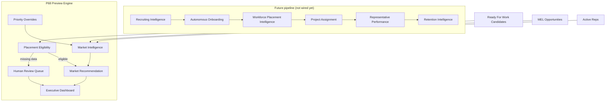
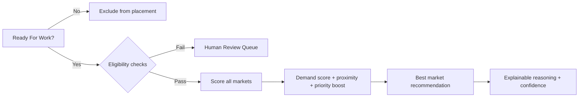

# P68 — Workforce Placement Intelligence Validation Report

**Validated:** 2026-06-26  
**Mode:** Preview only — no assignments, notifications, MEL updates, or production writes

---

## Executive summary

P68 introduces the **Workforce Placement Intelligence Engine**, which recommends **hiring markets** (not individual projects) for Ready For Work candidates. The engine optimizes long-term market coverage using demand scores, priority overrides, explainable reasoning, and a human review queue.

| Check | Result |
|-------|--------|
| Market-based recommendations (not project assignment) | ✅ |
| Ready For Work eligibility gate | ✅ |
| Smartphone / transportation / experience checks | ✅ |
| Human Review queue with visible reasons | ✅ |
| Market demand scoring (extensible factors) | ✅ |
| Priority market overrides (preview config) | ✅ |
| Tie handling — multiple candidates per market | ✅ |
| Executive dashboard panel | ✅ |
| Candidate workspace preview panel | ✅ |
| GET-only API | ✅ |
| Unit tests | ✅ 6/6 workforce-placement tests |
| Full suite | ✅ Passes |
| Production build | ✅ Passes |

---

## Architecture



---

## Recommendation engine



---

## Market scoring example

**Cincinnati, OH**

| Factor | Value |
|--------|-------|
| Open stores | 42 |
| Active representatives | 6 |
| Staffing shortage | Yes |
| Demand score | 94 |
| Recommended | Yes |

**Houston, TX** (priority override)

| Factor | Value |
|--------|-------|
| Priority level | Critical |
| Reason | Large Client Launch |
| Score boost | +25 |
| Expires | July 5, 2026 |

Demand factors are extensible via `MarketDemandFactors.extensions` for future business rules.

---

## Human review example

```
Candidate: Alex Rivera
Status: Human Review Required

✓ Ready For Work
✓ Retail Experience
✓ Smartphone
✗ Transportation Not Confirmed

Reason: Transportation not confirmed.
```

---

## Candidate recommendation example

```
Recommended Market: Cincinnati, OH
Confidence: 96%
Demand Score: 94

Reasoning:
✓ Highest demand score
✓ Candidate lives nearby
✓ Transportation confirmed
✓ Retail experience detected
✓ Staffing shortage
✓ Priority coverage area

Coverage Impact: Projected 7.0 open stores per representative after placement.
```

---

## Tie handling

When multiple eligible candidates qualify for the same market, **all** receive recommendations for that market. The objective is market depth, not selecting a single winner.

---

## Success criteria

| Question | Answered by |
|----------|-------------|
| Is this candidate eligible for placement? | `eligibility.status` |
| Which market should we grow? | `recommendation.recommendedMarketLabel` |
| Why was that market selected? | `recommendation.reasoning` |
| Which candidates require human review? | `humanReviewQueue` |
| Which markets have greatest staffing need? | `recommendedMarkets` / `demandScore` |
| How confident is the recommendation? | `recommendation.confidenceScore` |

---

## Preview protections

| Guard | Status |
|-------|--------|
| No project assignments | ✅ |
| No production writes | ✅ |
| No notifications | ✅ |
| No MEL updates | ✅ |
| No automation execution | ✅ |
| API is GET/read-only | ✅ |
| Preview Mode badges in UI | ✅ |

---

## Validation script

```bash
npx tsx scripts/p68-validate-preview.ts
```

---

## Files added

**Engine:** `src/lib/workforce-placement-intelligence/`  
**API:** `src/app/api/workforce-placement-intelligence/route.ts`  
**UI:** `workforce-placement-panel.tsx`, `candidate-workforce-placement-preview-panel.tsx`  
**Validation:** `scripts/p68-validate-preview.ts`

**Not committed** per instructions until validation review is complete.
