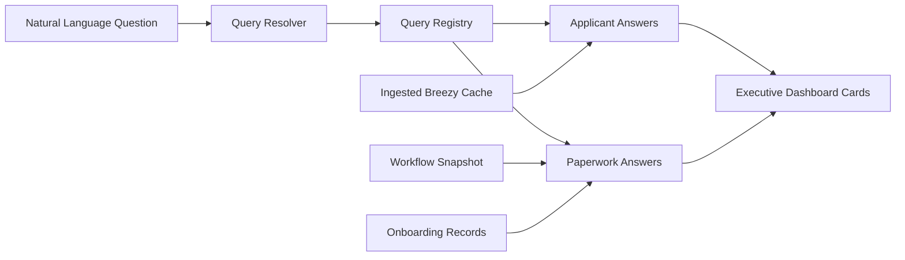

# P69 — Executive Natural Language Queries Validation Report

**Validated:** 2026-06-26  
**Mode:** Preview only — no production writes, automation, or external mutations

---

## Executive summary

P69 enables executives and recruiters to ask operational questions in plain language and receive read-only answers from ingested recruiting data.

| Check | Result |
|-------|--------|
| Applicant metrics (today / week / month) | ✅ |
| Paperwork metrics (sent today/week, signed today) | ✅ |
| Yesterday comparison for applicants today | ✅ |
| Natural language question resolver | ✅ |
| Extensible query registry | ✅ |
| GET-only API | ✅ |
| Executive query cards UI | ✅ |
| Unit tests | ✅ 5/5 |
| Full suite | ✅ Passes |
| Production build | ✅ Passes |

---

## Supported questions

| ID | Question |
|----|----------|
| `applicants_today` | How many applicants applied today? |
| `applicants_week` | How many applicants applied this week? |
| `applicants_month` | How many applicants applied this month? |
| `paperwork_sent_today` | How many paperwork packets were sent today? |
| `paperwork_sent_week` | How many paperwork packets were sent this week? |
| `paperwork_signed_today` | How many candidates signed paperwork today? |

**Future stubs** (registry only): Ready For Work today, onboarding pipeline, human review, workforce recommendations, markets needing coverage, recruiter leaderboard, DM performance, open stores, capacity planning, candidate grades.

---

## Example responses

### Applicants today

```json
{
  "queryId": "applicants_today",
  "total": 128,
  "comparison": { "label": "Yesterday", "value": 112, "delta": 16, "direction": "up" },
  "sourceSystem": "Breezy ATS (ingested cache)",
  "lastRefreshedAt": "2026-06-26T14:42:00.000Z"
}
```

### Paperwork today

```json
{
  "queryId": "paperwork_sent_today",
  "metrics": { "sent": 42, "signed": 27, "pending": 15 },
  "sourceSystem": "Workflow + onboarding records (read-only)"
}
```

---

## API documentation

### `GET /api/executive-natural-language-queries`

Returns dashboard cards + all supported question answers.

### `GET /api/executive-natural-language-queries?q={question}`

Returns dashboard + matched `answer` for the natural language question.

### `GET /api/executive-natural-language-queries?list=supported`

Returns supported question catalog only.

**Auth:** executive, recruiter, dm (territory-scoped)  
**Methods:** GET only  
**Writes:** None

---

## Architecture



---

## Validation script

```bash
npx tsx scripts/p69-validate-preview.ts
```

---

## Preview protections

| Guard | Status |
|-------|--------|
| No production writes | ✅ |
| No automation execution | ✅ |
| No external mutations | ✅ |
| Preview Mode badge in UI | ✅ |

**Not committed** unless explicitly requested.
